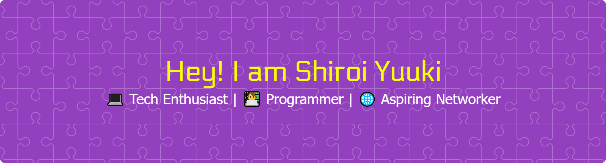

  

<h2 align="center">Hello There! 👋</h2>

 

<h3 align="center">Nice to meet ya ^_^</h3>

  

 

#### My skills (for now) 😊

 

#### My favorite browser 😉

 
 

#### 🖥️ Operating Systems I Can Use 🖥️ 
- Comfortable with 🐧 **Linux** 🐧.

- Experienced with 🔳 **Windows** 🔳.

Donate me [here](https://saweria.co/YUUKINEKO) 😋

  

