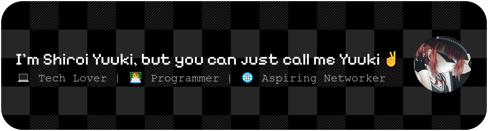

<h1 align="center">Hello There! 👋</h1>

  

 

<h4 align="center">Nice to meet ya ^_^</h4>

 

<h5 align="center">My skills (for now) 😊</h5>

  

<h5 align="center">My favorite browser 😉</h5>

  
  
  

<h5 align="center">🖥️ Operating Systems I Can Use🖥️</h5>

  🐧 Comfortable with **Linux**  
    

  🔳 Experienced with **Windows**  
    

    [**Donate me**](https://saweria.co/YUUKINEKO)  

 

